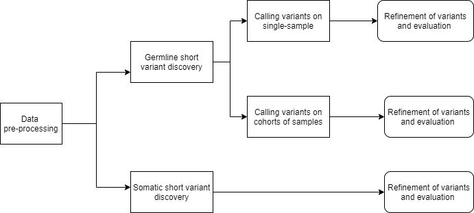
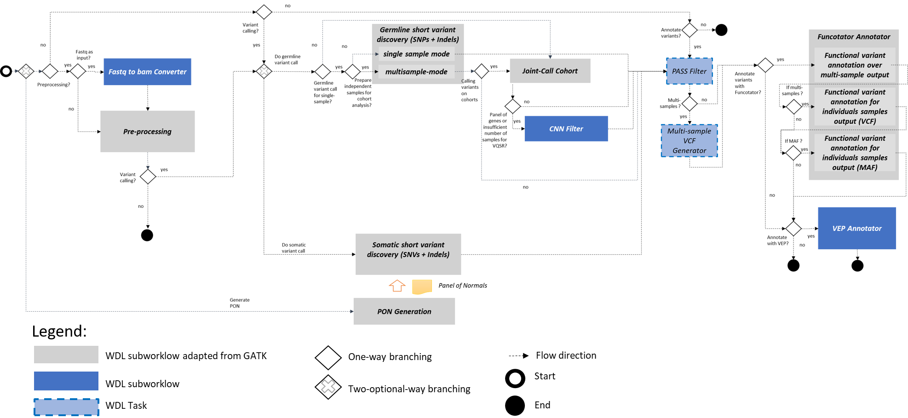

# PIPEMB-WDL
A repository for PIPEMB-WDL workflow  for variant discovery (SNPs and INDELs) using [GATK4](https://gatk.broadinstitute.org/hc/en-us/articles/360036194592-Getting-started-with-GATK4) and related tools. It was implemented to accomplish the [Best practices of GATK](https://gatk.broadinstitute.org/hc/en-us/articles/360035894711-About-the-GATK-Best-Practices) ,  and developed by INCA and PUC-Rio researchers. This workflow integrates pre-processing step, somatic and germline variant calling, and filtering and annotation steps. It was implemented using a [WDL](https://github.com/openwdl/wdl/blob/main/versions/1.0/SPEC.md) in its verion 1.0 and tested over [Cromwell engine](https://cromwell.readthedocs.io/en/stable/). 

List of interesting links:
-	[Getting started with GATK4](https://gatk.broadinstitute.org/hc/en-us/articles/360036194592-Getting-started-with-GATK4)
-	[Pipelining GATK with WDL and Cromwell](https://gatk.broadinstitute.org/hc/en-us/articles/360035889771-Pipelining-GATK-with-WDL-and-Cromwell)
-	[(How to) Execute Workflows from the gatk-workflows Git Organization](https://gatk.broadinstitute.org/hc/en-us/articles/360035530952--How-to-Execute-Workflows-from-the-gatk-workflows-Git-Organization)
-	[GATK on local HPC infrastructure](https://gatk.broadinstitute.org/hc/en-us/articles/360046877112-GATK-on-local-HPC-infrastructure)

The following figure represents a conceptual overview of the PIPEMB-WDL workflow:



The PIPEMB flow initially starts with the pre-processing of the input data. 
Pre-processing is a common step for both germline and somatic short variant calling. After pre-processing, it is possible to execute one type of study or both. Subsequently, each study has a validation step where specific filters are performed, and finally, the resulting variants can be annotated using the [VEP](https://www.ensembl.org/info/about/index.html) and [Funcotator](https://gatk.broadinstitute.org/hc/en-us/articles/360035889931-Funcotator-Information-and-Tutorial) programs. 


A component representation of the implemented workflow is shown in the following:


All the phases are integrated in a decoupled way. It is possible to execute a whole workflow including the three stages, taking the output from one and passing it as input for the next, or just starting the flow in any of them. Therefore, the implementation allows starting the execution pre-processing the reads for them call variant, or directly doing the variants call from a list of previously pre-processed files, of just filtering or annotate a list of files resulted from previous variant calling. Otherwise, the flow could contemplate only the pre-processing phase, or just only variant calling, or even just only annotation, since each stage is optional. 

## Running. 

As starting point **we highly recommend following** the [tutorial](doc/tutorial/Tutorial.pdf) and attending the [videos](doc/tutorial/videos). Also, this [presentation](doc/PIPEMB-WDL_INCA_PESQ_17082021_v2.pptx) will help a lot.

The workflow was deployment and tested over the cluster infracture of INCA, the [HPCC-Crab](https://www.inca.gov.br/en/node/2349). 


The basic sintaxis to execute a workflow described in WDL over Cromwell engine is:

```
java -Dconfig.file=<cromwell_file_config> -jar <cromwell_path_jar> run <wdl_file> --inputs <wofklow_input_json_file> &> <log_execution.log> &
```

As our tasks use docker containers, we use Singularity to execute them. Therefore we must set the Singularity variables before running the workflow, as follow:
```
SINGULARITY_CACHEDIR=$HOME/workflow/lib/cache/${USER}
SINGULARITY_TMPDIR=/scr/tmp
unset XDG_RUNTIME_DIR
```

The workflow could be executed directly in one node (single-node execution) or distributing the task over multiple nodes in the cluster (multi-node execution). 

### single-node execution

For single-node execution, we can directly use the command with the basic syntaxis. An example of real execution:

```
nohup java -Dconfig.file=cromwell-local-singularity-joblimit.conf -jar /data04/projects04/MarianaBoroni/workflow/bin/software/cromwell-49.jar run processing-for-variant-discovery-gatk4-vVM.wdl --inputs processing-for-variant-discovery-gatk4-crab.hg38.wgs.inputs.json >> console_teste_crab-hg38.txt &
```

This is a basic mode if we only want to test small workflows. To execute with tasks distribution on large scale, the multi-node mode is recommended. 

### multi-node execution:

For scheduling and distribute tasks in the cluster, is used Slurm. It is necessary to specify in the Cromwell config this integration and execute the main command through Slurm. To simply this, a slurm script is used (see examples in config/Executions, e.g. https://github.com/BioBD/PIPEMB-WDL/blob/main/config/Examples/pre0g0jn0s1pn1v1f1/run_workflow_INCA_g0jn0s1pn1v1f1_localimage_joblimit50_exclusiveuser_noprepr.slurm). In that script must be inserted the path of the WDL, the Crowmell jar path, and the JSON input.

```
# ----------------User vars-----------------------

### cromwell config
CONFIG=<cromwell_file_config>

### jar
JAR=<cromwell_path_jar>

### workflow description
WDL=<wdl_file>

### vars description
JSON=<wofklow_input_json_file>
```

The config files used in the examples are in (config/)

```
backend {
  default = slurm

  providers {
    slurm {
      actor-factory = "cromwell.backend.impl.sfs.config.ConfigBackendLifecycleActorFactory"                                                                                     
      config {
        concurrent-job-limit = 50
        run-in-background = true
        runtime-attributes = """
        Int cpus = 14
        String? docker
        String? extraMount
        String? local_image
        """

        submit = """
            sbatch \
              --wait \
              -J ${job_name} \
              -D ${cwd} \
              -o ${out} \
              -e ${err} \
              ${"-c " + cpus} \
              --wrap "/bin/bash ${script}"
        """

        submit-docker = """
            # Ensure singularity is loaded if it's installed as a module
            which singularity

            # Submit the script to SLURM
            sbatch \
              --exclusive=user \
              --wait \
              -J ${job_name} \
              -D ${cwd} \
              -o ${cwd}/execution/stdout \
              -e ${cwd}/execution/stderr \
              ${"-c " + cpus} \
              --wrap "singularity exec --bind ${cwd}:${docker_cwd}${extraMount} ${local_image} ${job_shell} ${script}"
        """
      }
    }
  }
}
```
Command execution:
```
sbatch script.slurm
```

<!---We suggest starting using the examples in: https://github.com/BioBD/PIPEMB-WDL/tree/main/config/Examples/pre1g0jn0s0pn0v0f0 and https://github.com/BioBD/PIPEMB-WDL/tree/main/config/Examples/g1SMfl11jn0s0pn0v1f1 --->

## Output description:
The structure of the results in the selected directory (-	output_dir parameter) is the following:
- **_bam_**: contains bam files resulting from preprocessing. Optional output, if it is used (do_preprocessing = true, default). 
- **_germline/somatic_vcfs_**: contains the vcf files resulting from germline/somatic variants call (HaplotypeCaller + CNNScoreVariants + FIlterVariantTranches / Program Mutect2 + FilterMutectCalls). Note: In the case of somatic, the filename has a T in front of it, but the truth is a vcf with the result for normal and tumor sample from the same sample. Optional output, if it is used (do_<germline/somatic>_short_variant_discovering = true) .
- **_germline/somatic_PASS_**: filtered vcf, contains only those variants that have "PASS" in the filter column. Optional output, if variant call or annotation is set. 
- **_germline/somatic_vcfs_merged_**: Contains the file final_vcf_all_samples.vcf. It is a multisample vcf, containg the variants present in the germline/somatic_PASS folder in a single file. Optional output, if variant call or annotation is set, and it is a multisample study.
-** _germline/somatic_funcotator_annot_**: Contains the file  final_vcf_all_samples annotated by Funcotator. Optional output, if it is used (germline/somatic_annot_with_funcotator = true)
- **_germline/somatic_funcotator_indep_samples_annot_**: Contains a one file for each sample annotated by Funcotator using VCF format. Optional output, if it is used (germline/somatic_annot_with_funcotator_add_allsamples = true)
- **_germline/somatic_funcotator_maf_annot_**: Contains a one file for each sample annotated by Funcotator using MAF format. Optional output, if it is used (germline/somatic_annot_with_funcotator_add_maf = true)
- **_germline/somatic_vep_annot_**: Contains file  final_vcf_all_samples annotated by Funcotator (if defined) and by VEP. Final file resulting from the workflow. Optional output, if it is used (germline/somatic_annot_with_vep = true)

## Input file that describes sequences to be analyzed:

The input file referenced by parameter -	flowcell_unmapped_input_tsv are listed below:

1. Read group identifier
2. Sequence file address ( .ubam, .fastq extensions)
3. Sequence file address 2 ( for pair-end .fastq files)
4. Line identifier (unique for each line)
5. Sample name, same for all lines of the same sample
6. Sequencing platform
7. Library preparation
8. Pairing: "paired"
9. Sample type: "tumor" or "normal"
10. Paired sample: if you are going to do a tumor/normal somatic study, in this column put the name of the paired sample

Rules:
-	If the samples were pair-end, there are columns number 2 and 3, if not, only 2. 
-	Column 10 exists only if it is tumor/normal somatic study.


## Parameters description:

### General parameters:
-	```reference_file ```-- references specification file path. String value.
-	```output_dir ```-- path for directory for output files (with no “/” at the end). String value.
-	```flowcell_unmapped_input_tsv ```-- tsv file path with the list of file samples to process. String value.
-	```inputs_directory ```-- directory path for unmapped files in case that it is not included in the flowcell_unmapped_input_tsv. String value. Optional.
-	```unmapped_bam_suffix ```-- unmapped bam files suffix name. String value. 
-	```unmapped_fastq_suffix ```-- unmapped fasta files suffix name. String value.
-	```input_is_pairend ```-- specifies is paired-end sequences form the input. Boolean value, default value: false.
-	```execute_mark_adaptors ```-- specifies whether to mark the adaptors. Boolean value, default value: false.
-	```inputs_are_amplified_sequences ```-- specifies whether the input comes from IronTorrents technology. If it has the value true, duplicate marking during the processing step will NOT be applied because it is an amplicon sequencing data. Boolean value, default value: false.

### Optional runtime parameters: 
To use a docker image:
-	```gatk_docker_override ```-- allows to specifies the docker container with the GATK tools ready to execute the workflow. String value. Currently, it is used "broadinstitute/gatk:4.1.0.0"
-	```gatk_path_override ```-- allows to specifies the path of GATK into the docker container. String value.
-	```gotc_docker_override ```-- allows to specifies the docker container for execute other non-GATK commands. String value. Currently, it is used "broadinstitute/genomes-in-the-cloud:2.3.1-1512499786"
-	```gotc_path_override ```-- allows to specifies the path execute other non-GATK commands into the gotc_docker container. String value.
-	```python_docker_override ```-- allows to specifies the docker container with python ready to execute the workflow. String value. Currently, it is used "python:2.7".
-	```vep_docker  ```-- allows to specifies the docker container with VEP ready to execute the workflow. String value. Currently, it is used "ensemblorg/ensembl-vep:release_101.0".

To use a local docker image precompilated as Singularity image:
- ```gatk_docker_local_image ```-- Local image with main GATK tools.
- ```gotc_docker_local_image ```-- Local image with Picard tools.
- ```python_docker_local_image ```-- Local image with Python.
- ```vep_docker_local_image ```--Local image with VEP.

Default values for these parameters cover the last images available until march 2021.

### Parameters that define main subworkflows:
-	```input_is_fastq ```-- specifies is the input is in fastq format. If it is true, then will be execute FastqToBam task previously to the pre-processing. Boolean value, default value: false.
-	```do_preprocessing ```-- specifies whether to execute data pre-processing subworkflow. Boolean value, default value: true.
-	```do_germline_short_variant_discovering ```-- specifies whether to execute the germline subworkflow. Boolean value, default value: false.
-	```do_germline_cohort ```-- specifies whether to execute the join genotyping subworkflow. Boolean value, default value: false.
-	```do_somatic_short_variant_discovering ```-- specifies whether to execute the somatic subworkflow (Normal-Tumor analysis). Boolean value, default value: false.
-	```do_annotation_vep ```-- specifies whether to annotate the VCF output from the executed studies. Boolean value, default value: false.
-	```rna_seq_analysis```-- specifies whether the input data must be treated as RNAseq data. Boolean value, default value: false.

#### Additional parameters to execute data **pre-processing**:
<!--- -	```bwa_commandline_override ```-- allows specifies the command line for BWA call. String value. For example, default value is : "bwa mem -K 100000000 -p -v 3 -t 16 -Y $bash_ref_fasta"---> 
-	```compression_level ```-- the compression level parameter used for some tools, like SamToFastq, MergeBamAlignment, SortSam, SetNmMdAndUqTags, etc., during the pre-processing. This value is setted through the java call Dsamjdk.compression_level=~{compression_level}. Int value, default value: 5.
-	```execute_with_spark ```-- specifies whether to execute some Spark-enabled GATK tools. Currently only BaseRecalibratorSpark (BETA) is available. Boolean value, default: true.

A group of legacy values is used to set the disk size for some tools executions during the pre-processing. They are: flowcell_small_disk, flowcell_medium_disk, agg_small_disk, agg_medium_disk, agg_large_disk. Default values are set in the main WDL. However, they were not used in our executions because the backend used is docker.

#### Additional parameters to execute **germline** study 
-	```input_is_multisample ```-- specifies whether the input is multisample. Boolean value, default value: false.
- ```input_preprocessed_bams_list_for_germline ```-- list of preprocessed bams. If do_preprocessing = false, them a list of preprocessed bams and their indexes must be provided.
- ```input_preprocessed_bams_index_list_for_germline ```-- list of preprocessed bams indexes. If do_preprocessing = false, them a list of preprocessed bams and their indexes must be provided.
- ```germline_filter_variants_single_sample ```-- specifies whether to execute the filter over variants outputted from germline variant calling for a single sample. Boolean value, default value: false.
- ```germline_single_sample_mode ```-- specifies whether to execute HaplotypeCaller for single sample mode, generating VCF output, or as multisample mode, generating GVCF outputs. Boolean value, default value: true.
- ```germline_scatter_count ```-- number of parallel jobs to generate when scattering over intervals. Integer value.
- ```germline_split_intervals_extra_args ```-- additional arguments for splitting intervals before scattering. String value. Optional.


  If **germline_filter_variants_single_sample** is true, must be provided the following parameters:
  - ```germline_filter_snp_tranches ```-- specifies the filtering threshold(s) for SNPs in terms of sensitivity to overlapping known variants in resources. String value.
  - ```germline_filter_indel_tranches ```-- specifies the filtering threshold(s) for INDELs in terms of sensitivity to overlapping known variants in resources. String value.
  - ```germline_filter_info_key ```-- specifies the score key for the info field of the vcf (e.g. CNN_1D, CNN_2D). String value.
  - ```germline_filter_output_prefix ```-- identifying string for this run will be used to name all output files. String value.

- ```germline_annot_with_funcotator ```-- specifies whether to execute the annotation over the filtered variants with Funcotator for merged multisample VCF. Boolean value, default value: false.
- ```germline_annot_with_funcotator_add_allsamples ```-- specifies whether to execute the annotation over the filtered variants with Funcotator for each sample in VCF format. Boolean value, default value: false.
- ```germline_annot_with_funcotator_add_maf ```-- specifies whether to execute the annotation over the filtered variants with Funcotator for each sample in MAF format. Boolean value, default value: false.

  If **germline_annot_with_funcotator** is true, must be provided the following parameters: 
  
  -	```input_preprocessed_vcf_list_for_germline_funcotator ```-- list of variant called files (.vcf) for Funcotator annotation. If do_germline_short_variant_discovering = false, but germline_annot_with_funcotator = true, them a list of vcfs must be provided.
  -	```germline_sequencing_center ```--sequencing center name. String value. Optional.
  -	```germline_sequence_source ```-- sequencing source. String value. Optional.
  -	```germline_funco_reference_version ```-- "hg19" for hg19 or b37. "hg38" for hg38. String value. Default: "hg19".
  -	```germline_funco_output_format ```-- "MAF" to produce a MAF file, "VCF" to procude a VCF file. String value. Default: "MAF".
  -	```germline_funco_compress ```-- Only valid if funco_output_format == "VCF". Boolean value. If true, will compress the output of Funcotator. If false, produces an uncompressed output file. Default: false.
  -	```germline_funco_use_gnomad_AF ```-- If true, will include gnomAD allele frequency annotations in output by connecting to the internet to query gnomAD (this impacts performance). If false, will not annotate with gnomAD. Boolean value. Default: false.
  -	```germline_funco_transcript_selection_mode ```-- How to select transcripts in Funcotator. Options: ALL, CANONICAL, or BEST_EFFECT. String value. Default: CANONICAL.
  -	```germline_funco_transcript_selection_list ```-- Transcripts (one GENCODE ID per line) to give priority during selection process. File path. Optional value.
  -	```germline_funco_dir_cache ```-- Path to the funcotator files. Funcotator datasources untar gz file. 
  -	```germline_funco_annotation_defaults ```-- Default values for annotations, when values are unspecified. Specified as  <ANNOTATION>:<VALUE>. For example:  "Center:Broad". Array[String] value. Optional.
  -	```germline_funco_annotation_overrides ```-- Values for annotations, even when values are unspecified. Specified as  <ANNOTATION>:<VALUE>. For example:  "Center:Broad". Array[String] value. Optional.
  -	```germline_funcotator_excluded_fields ```-- Annotations that should not appear in the output (VCF or MAF). Specified as  <ANNOTATION>. For example: "ClinVar_ALLELEID". Array[String] value. Optional.
  -	```germline_funco_filter_funcotations ```-- If true, will only annotate variants that have passed filtering (. or PASS value in the FILTER column). If false, will annotate all variants in the input file. Boolean value. Default: true.
  -	```germline_funcotator_extra_args ```-- Any additional arguments to pass to Funcotator. Default: "".

  If **germline_annot_with_vep** is true, must be provided the following parameters:
 
   - ```germline_input_preprocessed_vcf_list_for_germline_vep ```-- list of variant called files (.vcf) for VEP annotation. If do_germline_short_variant_discovering = false, but germline_annot_with_vep = true, them a list of vcfs must be provided.
   - ```germline_input_preprocessed_vcf_list_for_somatic_vep ```-- list of variant called files (.vcf) for VEP annotation. If do_somatic_short_variant_discovering = false, but somatic_annot_with_vep = true, them a list of vcfs must be provided.
   - ```germline_vep_assembly_name ```-- Select the assembly version to use if more than one available. If using the cache, you must have the appropriate assembly's cache file installed, for example "GRCh38". If not specified and you have only 1 assembly version installed, this will be chosen by default. String value. Default = use found assembly version. 
   - ```germline_vep_num_forks ```-- Enable forking, using the specified number of forks. Forking can dramatically improve runtime. Interger value. Optional.
   - ```germline_vep_dir_cache ```-- Specify a cache directory to use. Directory path. Default = "$HOME/.vep/". Optional.
   - ```germline_vep_dir_cache_sing ```-- Specify a cache directory to mount cache files into the container manage by Singularity. Directory path. Optional.
   - ```germline_vep_input_suffix ```-- ```input suffix. The input vcf basename. String.
   - ```germline_vep_offline_execution ```-- If true the VEP is execute offline
   - ```germline_vep_gff ```-- Use GFF transcript annotations in [filename] as an annotation source. Requires a FASTA file of genomic sequence. File path. Optional.
   - ```germline_vep_gtf ```-- Use GTF transcript annotations in [filename] as an annotation source. Requires a FASTA file of genomic sequence. File path. Optional.
   - ```germline_vep_extra_args ```-- additional arguments for VEP execution. String value. Optional.

- If **do_germline_cohort** is true, must be provided the following parameters to execute the joint genotyping analysis:
  - ```joingenot_callset_name ```-- name for the result of the analysis. Define the set of samples with which the joint call has been executed. String.
  - ```joingenot_small_disk ```-- estimated disk size for tasks that require a small disk size. Integer.
  - ```joingenot_medium_disk ```-- estimated disk size for tasks that require a medium disk size. Integer.
  - ```joingenot_large_disk ```-- estimated disk size for tasks that require a large disk size. Integer.
  - ```joingenot_huge_disk ```-- estimated disk size for tasks that require a huge disk size. Integer.
  - ```input_preprocessed_gvcf_for_jointgenotyping ```-- defines is the input is a preprocessed list of gvcf or not. If do_preprocessing = false and do_germline_short_variant_discovering= false, but do_germline_cohort= true, them a list of preprocessed bams and their indexes must be provided.
  - ```input_preprocessed_gvcf_list_for_jointgenotyping ```-- list of preprocessed gvcf. If do_preprocessing = false and do_germline_short_variant_discovering= false, but do_germline_cohort= true, them a list of preprocessed bams and their indexes must be provided.
  - ```joingenot_rename_gvcf_samples ```-- if true rename the gvcf samples. Boolean value. Optional.
  - ```input_preprocessed_gvcf_indx_list_for_jointgenotyping ```-- list of preprocessed gvcf indexes. If do_preprocessing = false, them a list of preprocessed bams and their indexes must be provided.
  - ```joingenot_snp_recalibration_tranche_values ```--  The levels of truth sensitivity at which to slice the data. (in percent, that is 1.0 for 1 percent) for SNPs in VariantRecalibrator call. List[Double], example [100.0, 99.9, 99.0, 90.0]
  - ```joingenot_snp_recalibration_annotation_values ```-- The names of the annotations which should used for calculations for SNPs. See the input VCF file's INFO field for a list of all available annotations. Array[String] value.
  - ```joingenot_indel_recalibration_tranche_values ```-- The levels of truth sensitivity at which to slice the data. (in percent, that is 1.0 for 1 percent) for Indels in VariantRecalibrator call. List[Double], example [100.0, 99.9, 99.0, 90.0].
  - ```joingenot_indel_recalibration_annotation_values ```-- The names of the annotations which should used for calculations for Indels. See the input VCF file's INFO field for a list of all available annotations. Array[String] value.
  - ```joingenot_snp_filter_level ```-- The truth sensitivity level at which to start filtering SNPs. Double value.
  - ```joingenot_indel_filter_level ```-- The truth sensitivity level at which to start filtering Indels. Double value.
  - ```joingenot_SNP_VQSR_downsampleFactor ```-- Integer value (VariantRecalibrator, ```--sample-every-Nth-variant).

  - ```joingenot_top_level_scatter_count ```-- Reference value to define the number parallel executions in a task. Integer. Optional value.
  - ```joingenot_gather_vcfs ```-- If true, the VCF shards be gather and collect metrics directly. For small callsets (fewer than 1000 samples) the VCF shards could be gather and collect metrics directly. For anything larger, it is needed to keep the VCF sharded and gather metrics collected from them. This parameter allow overriding this default behavior for testing / special requests. Boolean value. Optional value.
  - ```joingenot_snps_variant_recalibration_threshold ```--  Defines the threshold number for executing VariantRecalibrator, creating a model. If the number of GVCFs is greater than this threshold, the VariantRecalibrator is executed using options like--sample-every-Nth-variant and ```--output-model ~{model_report_filename}. Integer value. Default = 500000.
  - ```joingenot_unbounded_scatter_count_scale_factor ```-- Reference value to define the number parallel executions in a task (optional). Float value. Default = 0.15.
  - ```joingenot_gnarly_scatter_count ```-- Reference value to define the number parallel executions for GnarlyGenotyper. It is used for splitting interval list. Integer value. Default = 10.
  - ```joingenot_use_gnarly_genotyper ```-- If true, it is used GnarlyGenotyper that performs "quick and dirty" joint genotyping on one or more samples pre-called with HaplotypeCaller. Boolean value. Default = false . More information about GnarlyGenotyper in https://gatk.broadinstitute.org/hc/en-us/articles/360050813612-GnarlyGenotyper-BETA-
  - ```joingenot_use_allele_specific_annotations ```-- Corresponds to the ```--use-allele-specific-annotations option for VariantRecalibrator and ApplyVQSR. If specified, the variant recalibrator will attempt to use the allele-specific versions of the specified annotations. If specified, the ApplyVQSR tool will attempt to apply a filter to each allele based on the input tranches and allele-specific .recal file. Boolean value. Default = true.
  - ```joingenot_cross_check_fingerprints ```-- Defines whether to execute CrosscheckFingerprints (Picard) tool. Boolean value. Optional.
  - ```joingenot_scatter_cross_check_fingerprints ```--If true, enables the scatter over the input GVCFs in CrosscheckFingerprints (Picard) tool (https://gatk.broadinstitute.org/hc/en-us/articles/360050816052-CrosscheckFingerprints-Picard-). Boolean value. Default = false.
  - ```joingenot_do_filter_by_variant_recalibration ```-- Defines whether to filter the variant using VariantRecalibration tool. Boolean value, default = true
  - ```joingenot_filter_variants_CNN ```-- Defines whether to filter the variant using CNN model. Boolean value, default = false


#### Additional parameters to execute somatic study  (Normal-Tumor study)

 
 - ```input_preprocessed_bams_tumor_list_for_somatic ```-- list of preprocessed tumor bams. If do_preprocessing = false, them a list of preprocessed bams and their indexes must be provided
 - ```input_preprocessed_bams_tumor_index_list_for_somatic ```-- list of preprocessed tumor bams indexes. If do_preprocessing = false, them a list of preprocessed bams and their indexes must be provided
 - ```input_preprocessed_bams_normal_list_for_somatic ```-- list of preprocessed normal bams. If do_preprocessing = false, them a list of preprocessed bams and their indexes must be provided.
 - ```input_preprocessed_bams_normal_index_list_for_somatic ```-- list of preprocessed normal bams indexes. If do_preprocessing = false, them a list of preprocessed bams and their indexes must be provided.
 - ```somatic_all_samples_tumor ```-- defines whether the all samples are tumor samples. Boolean value, default = false.
 - ```somatic_m2_extra_args ```-- additional arguments for Mutect2 calling. String value. Optional.
 - ```somatic_m2_extra_filtering_args ```-- additional arguments for Mutect2 filtering. String value. Optional.
 - ```somatic_split_intervals_extra_arg ```-- additional arguments for splitting intervals before scattering. String value. Optional.
 - ```somatic_scatter_count ```-- number of parallel jobs to generate when scattering over intervals. Integer value.
 - ```somatic_run_orientation_bias_mixture_model_filter ```--  if true, filter orientation bias sites with the read orientation artifact mixture model. Boolean value. Optional. 
 - ```somatic_pon ```-- panel of normals in VCF format containing probable technical artifacts (false positives). File path. Optional.
 - ```somatic_pon_idx ```-- panel of normals index. File path. Optional.
 - ```somatic_gnomad ```-- database of known germline variants (see http://gnomad.broadinstitute.org/downloads). File path. Optional.
 - ```somatic_gnomad_idx ```-- database of known germline variants indexes. File path. Optional.
 - ```somatic_variants_for_contamination ```-- VCF of common variants with allele frequencies for calculating contamination. File path. Optional.
 - ```somatic_variants_for_contamination_idx ```-- index of the VCF of common variants index with allele frequencies for calculating contamination. File path. Optional.
 - ```somatic_realignment_index_bundle ```-- resource for FilterAlignmentArtifacts, which runs if and only if it is specified. Generated by BwaMemIndexImageCreator. File path. Optional.
 - ```somatic_realignment_extra_args ```-- additional arguments for realignment. String value. Optional.
 - ```somatic_make_bamout ```-- If true, the assembled haplotypes and locally realigned reads will be written as BAM. Boolean value. Optional.
 - ```somatic_compress_vcfs ```-- If true, will compress the VCF output. Boolean value. Optional.
 - ```somatic_gga_vcf ```-- The set of alleles to force-call regardless of evidence. File path. Optional.
 - ```somatic_gga_vcf_idx ```-- The index of the set set of alleles to force-call regardless of evidence. File path. Optional.
 - ```somatic_annot_with_funcotator ```-- specifies whether to execute the annotation over the filtered variants with Funcotator for merged multisample VCF. Boolean value, default value: false.
 - ```somatic_annot_with_funcotator_add_allsamples ```-- specifies whether to execute the annotation over the filtered variants with Funcotator for each sample in VCF format. Boolean value, default value: false.
 - ```somatic_annot_with_funcotator_add_maf ```-- specifies whether to execute the annotation over the filtered variants with Funcotator for each sample in MAF format. Boolean value, default value: false.
 - ```somatic_annot_with_vep  ```-- specifies whether to execute the annotation over the filtered variants with VEP. Boolean value, default value: false.

 
   If **somatic_annot_with_funcotator** is true, must be provided the following parameters:

   - ```input_preprocessed_vcf_list_for_somatic_funcotator ```-- list of variant called files (.vcf) for Funcotator annotation. If do_somatic_short_variant_discovering = false, but somatic_annot_with_funcotator = true, them a list of vcfs must be provided.      
   - ```somatic_sequencing_center ```-- sequencing center name. String value. Optional.
   - ```somatic_sequence_source ```-- sequencing source. String value. Optional.
   - ```somatic_funco_reference_version ```-- "hg19" for hg19 or b37. "hg38" for hg38. String value. Default: "hg19".
   - ```somatic_funco_output_format ```-- "MAF" to produce a MAF file, "VCF" to procude a VCF file. String value. Default: "MAF".
   - ```somatic_funco_compress ```-- Only valid if funco_output_format == "VCF". Boolean value. If true, will compress the output of Funcotator. If false, produces an uncompressed output file. Default: false.
   - ```somatic_funco_use_gnomad_AF ```-- If true, will include gnomAD allele frequency annotations in output by connecting to the internet to query gnomAD (this impacts performance). If false, will not annotate with gnomAD. Boolean value. Default: false.
   - ```somatic_funco_transcript_selection_mode ```-- How to select transcripts in Funcotator. Options: ALL, CANONICAL, or BEST_EFFECT. String value. Default: CANONICAL.
   - ```somatic_funco_transcript_selection_list ```-- Transcripts (one GENCODE ID per line) to give priority during selection process. File path. Optional value.
   - ```somatic_funco_dir_cache```-- Path to the funcotator files. Funcotator datasources untar gz file.
   - ```somatic_funco_annotation_defaults ```-- Default values for annotations, when values are unspecified. Specified as  <ANNOTATION>:<VALUE>. For example:  "Center:Broad". Array[String] value. Optional.
   - ```somatic_funco_annotation_overrides ```-- Values for annotations, even when values are unspecified. Specified as  <ANNOTATION>:<VALUE>. For example:  "Center:Broad". Array[String] value. Optional.
   - ```somatic_funcotator_excluded_fields ```-- Annotations that should not appear in the output (VCF or MAF). Specified as  <ANNOTATION>. For example: "ClinVar_ALLELEID". Array[String] value. Optional.
   - ```somatic_funco_filter_funcotations ```-- If true, will only annotate variants that have passed filtering (. or PASS value in the FILTER column). If false, will annotate all variants in the input file. Boolean value. Default: true.
   - ```somatic_funcotator_extra_args ```-- Any additional arguments to pass to Funcotator. Default: "".
 

   If **somatic_annot_with_vep** is true, must be provided the following parameters:
   
   - ```somatic_input_preprocessed_vcf_list_for_germline_vep ```-- list of variant called files (.vcf) for VEP annotation. If do_germline_short_variant_discovering = false, but germline_annot_with_vep = true, them a list of vcfs must be provided.
   - ```somatic_input_preprocessed_vcf_list_for_somatic_vep ```-- list of variant called files (.vcf) for VEP annotation. If do_somatic_short_variant_discovering = false, but somatic_annot_with_vep = true, them a list of vcfs must be provided.
   - ```somatic_vep_assembly_name ```-- Select the assembly version to use if more than one available. If using the cache, you must have the appropriate assembly's cache file installed, for example "GRCh38". If not specified and you have only 1 assembly version installed, this will be chosen by default. String value. Default = use found assembly version. 
   - ```somatic_vep_num_forks ```-- Enable forking, using the specified number of forks. Forking can dramatically improve runtime. Interger value. Optional.
   - ```somatic_vep_dir_cache ```-- Specify a cache directory to use. Directory path. Default = "$HOME/.vep/". Optional.
   - ```somatic_vep_dir_cache_sing ```-- Specify a cache directory to mount cache files into the container manage by Singularity. Directory path. Optional.
   - ```somatic_vep_input_suffix ```-- ```input suffix. The input vcf basename. String.
   - ```somatic_vep_offline_execution ```-- If true the VEP is execute offline
   - ```somatic_vep_gff ```-- Use GFF transcript annotations in [filename] as an annotation source. Requires a FASTA file of genomic sequence. File path. Optional.
   - ```somatic_vep_gtf ```-- Use GTF transcript annotations in [filename] as an annotation source. Requires a FASTA file of genomic sequence. File path. Optional.
   - ```somatic_vep_extra_args ```-- additional arguments for VEP execution. String value. Optional.
 
 
 -	```do_somatic_creating_pon ```-- Create a Panel of normals (PON) to use as input for somatic study.
   If **do_somatic_creating_pon** is true, must be provided the following parameters to execute the subworkflow for PON creation: 
      - ```somatic_pon_intervals ```-- ```genomic intervals. File path that contains the genomic intervals. Optional.
      - ```somatic_pon_scatter_count ```-- Number of parallel jobs when scattering over intervals. Integer value.
      - ```somatic_pon_normal_bams ```-- Array with the list of normal bams files. Array[String] value.
      - ```somatic_pon_normal_bais ```-- Array with the list of the indexes of normal bams. Array[String] value.
      - ```somatic_pon_gnomad ```-- database of known germline variants. File path value. Optional.
      - ```somatic_pon_gnomad_idx ```-- database of known germline variants indexes. File path value. Optional.
      - ```somatic_pon_m2_extra_args ```-- Additional command line parameters for Mutect2. String value. Optional. 
      - ```somatic_pon_create_pon_extra_args ```-- additional arguments for create PON. String value. Optional.
      - ```somatic_pon_compress ```-- If true, will compress the VCF output. Boolean value. Optional.
      - ```somatic_pon_name ```-- The resulting panel of normals is {pon_name}.vcf. String value.
      - ```somatic_pon_min_contig_size ```-- Minimum contig size. Integer value. Optional.
      - ```somatic_pon_num_contigs ```--  Minimum number of contigs. Integer value. Optional.

   For more information visit: https://gatk.broadinstitute.org/hc/en-us/articles/360036460312-Mutect2

#### Interval lists:
Interval lists define subsets of genomic regions, sometimes even just individual positions in the genome. You can provide GATK tools with intervals or lists of intervals when you want to restrict them to operating on a subset of genomic regions. 
GATK supports several types of interval list formats: Picard-style ```.interval_list```, GATK-style ```.list```, BED files with extension ```.bed```, and VCF files.
Source: [Intervals and interval lists](https://gatk.broadinstitute.org/hc/en-us/articles/360035531852-Intervals-and-interval-lists). 

In the following are the parameter to defined the genomic intervals lists in each process of the workflow:
 - ```preprocessing_intervals_list```: Genomic intervals file  used by BaseRecalibrator e ApplyRecalibration during the preprocessing phase. File path.
 - ```somatic_intervals_list```: Genomic intervals file used by Mutect2. File path.
 - ```germline_intervals_list```: Genomic intervals files containts the genomic intervals used by HaplotypeCaller. File path.  
 - ```joingenot_intervals_list```: Genomic intervals file used during the joint genotype call. File path.

  
## Reference file specification
 - ```ref_name```: Reference name. Default```: "hg38".
 - ```ref_fasta, ref_fai, ref_dict```: reference genome, index, and dictionary. File path.
 - ```ref_alt, ref_sa, ref_amb, ref_bwt, ref_ann, ref_pac```: reference genome resources. File path.
 - ```dbSNP_vcf, dbSNP_vcf_index```: Known SNPs and its indices. File path.
 - ```known_indels_sites_VCFs, known_indels_sites_indices```: Known indels site and its indices. File path.
 - ```somatic_pon_gnomad, somatic_pon_gnomad_idx```: The gnomAD VCF file and index. File path.
 - ```germline_filter_resources, germline_filter_resources_index```: List of resources (VCF files path and indices files path) to filter germline variants. Array[File].
 - ```joingenot_unpadded_intervals_file```: Genomic intervals file (.intervals) used to scatter main joint genotyping functions. File path.
 - ```joingenot_eval_interval_list```: Genomic intervals file (.list) used by CollectVariantCallingMetrics task. File path.
 - ```joingenot_haplotype_database```: File path. (Homo_sapiens_assembly38.haplotype_database.txt)
 - Other resources to execute joint genotyping (VCF files and indices)
    - ```joingenot_axiomPoly_resource_vcf```,```joingenot_axiomPoly_resource_vcf_index```
    - ```joingenot_hapmap_resource_vcf```, ```joingenot_hapmap_resource_vcf_index```
    - ```joingenot_mills_resource_vcf```, ```joingenot_mills_resource_vcf_index```
    - ```joingenot_omni_resource_vcf```, ```joingenot_omni_resource_vcf_index```
    - ```joingenot_one_thousand_genomes_resource_vcf```, ```joingenot_one_thousand_genomes_resource_vcf_index```

## Tips:
### FilterVariantTranches User error:

*Using the right value as info key* 

CNNScoreVariant, is the software recommended to filter vcf outputted by the single sample germline analysis. It annotates a VCF with scores from a Convolutional Neural Network (CNN). This tool streams variants and their reference context to a python program, which evaluates a pre-trained neural network on each variant. The neural network performs convolutions over the reference sequence surrounding the variant and combines those features with a multilayer perceptron on the variant annotations. Pre-trained 1D and 2D models are included in the distribution (https://gatk.broadinstitute.org/hc/en-us/articles/360037226672-CNNScoreVariants).

Then "germline_filter_info_key" specifies the score key for the info field of the vcf, e.g. "CNN_1D" or "CNN_2D".
Be sure to use the right info field of the vcf. If you are in doubt, then try to use first: "CNN_1D". Another way, is to open the vcf generated by CNNScoreVariant and verified the key used. 


*Bad input error*
```
A USER ERROR has occurred: Bad input: Indels are present in input VCF, but cannot be filtered because no overlapping indels were found in the resources.
```

The reason you see this error is because the number of SNPs and/or Indels are 0 in your input samples and resource files.
This problem might be happening because you are scattering over small sections of the genome or running a test on a subset of the sample. A way to resolve this is to increase the window size of the genomic region you are evaluating. (https://gatk.broadinstitute.org/hc/en-us/community/posts/360056456092-FilterVariantTranches-User-error)

Another solution is if the number of samples is enough, try to execute the joint genotyping call, and then apply the filter over the final vcf with all samples' information.  

### Filter Variants by Variant (Quality Score) Recalibration error:

```
A USER ERROR has occurred: Positive training model failed to converge.  One or more annotations (usually MQ) may have insufficient variance.  Please consider lowering the maximum number of Gaussians allowed for use in the model (via --max-gaussians 4, for example).
```
VariantRecalibrator performs the first pass in a two-stage process called Variant Quality Score Recalibration (VQSR). Specifically, it builds the model that will be used in the second step to actually filter variants. The result is a score called the VQSLOD that gets added to the INFO field of each variant. This score is the log odds of being a true variant versus being false under the trained Gaussian mixture model.
*--max-gaussians* parameter determines the maximum number of Gaussians that should be used when building a positive model using the variational Bayes algorithm. 
(https://gatk.broadinstitute.org/hc/en-us/articles/360036510892-VariantRecalibrator)

The error suggests reducing the max-gaussians. It is possible to had to end up using max-gaussian to 1.
According to some experiences commented in the GATK forum, this error will occur when the read data amount is just not big enough. Then will be necessary to try to bring in more samples or a larger genomic area for VQSR, or use another filter as CNN. (https://gatk.broadinstitute.org/hc/en-us/community/posts/360073061351-VQSR-positive-training-model-failed-to-converge)


